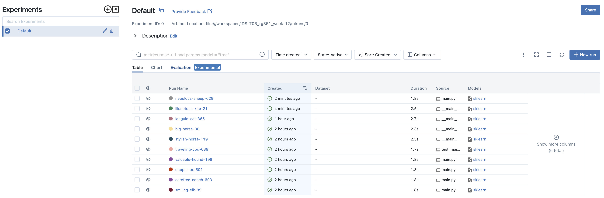

# Machine Learning using MLFlow

[](https://github.com/nogibjj/IDS-706_rg361_week-12/actions/workflows/cicd.yml)

This repositroy contains files to manage an End-to-End machine leanring project lifecycle using ``MLFlow``

The base repo has been created from [IDS-706_rg361_week-5](https://github.com/nogibjj/IDS-706_rg361_week-5) template and modified as per requirements.

Created on 19-Nov-2023

## Overview

The repository has the ``main.py`` file which fits a simple linear regression using ``scikit-learn`` on the [Sample Dataset](https://github.com/Opensourcefordatascience/Data-sets/raw/master/automotive_data.csv) from Github.

``MLFlow`` is used to keep track of the model and it's parameters and these are stored in the ``mlruns`` folder.

Github CICD actions are automatically triggered whenever there is any change in the repository.

## Instructions & Sample Execution

Create a Codespace on main which will initialize the enviroment with the required packages and settings to execute the codes.

run the following command from the Terminal:

```console
python main.py
```
The main.py file loads the CSV dataset and performs basic data processing and then fits a Linear Regression Model using scikit-learn library.

The file then logs some of the parameters of the model and its performance using the ``MLFlow`` package.
These results are stored in the ``mlruns`` folder.

To have an interactive view of the results, run the following command in the Terminal

```console
mlflow ui --port 5000
```
This will open a browser section where the user can view and interact with the information about the models:

View of All executions:


Detailed view of single execution:


## Contents
The repository contains the following items:

### 1. README.md
   contains the information about the repository and instructions for using it
   
### 2. requirements.txt
   contains the list of packages and libraries which are required for running the project. These are intalled and used in the virtual environment and Github actions.
   
### 3. .github/workflows
   github actions are used to automate the following processes whenever a change is made to the files in the repository:
   - ``install`` : installs the packages and libraries mentioned in the requirements.txt
   - ``test`` : uses ``pytest`` to test the python script
      
     
   - ``format`` : uses ``black`` to format the python files
   - ``lint`` : uses ``ruff`` to lint the python files
   
     
   **Note** -if all the processes run successfully the following output will be visible in github actions:
   
   
### 4. Makefile
   contains the instructions and sequences for the processes used in github actions and .devcontainer for creating the virtual environment
   
### 5. .devcontainer
   contains the ``dockerfile`` and ``devcontainer.json`` files which are used to build and define the setting of the virtual environment (codespaces - python) for running the codes.

### 6. Data
   The CSV data file is stored here for quick access

### 7. resources 
   contains additonal files which are used in the README

### 8. Code files:
1. ``main.py`` : to perform the Model fitting and tracking using MLFlow as mentioned earlier
2. ``test_main.py`` : To verify if the main file works properly and if the MLFlow data is saved
   


  
